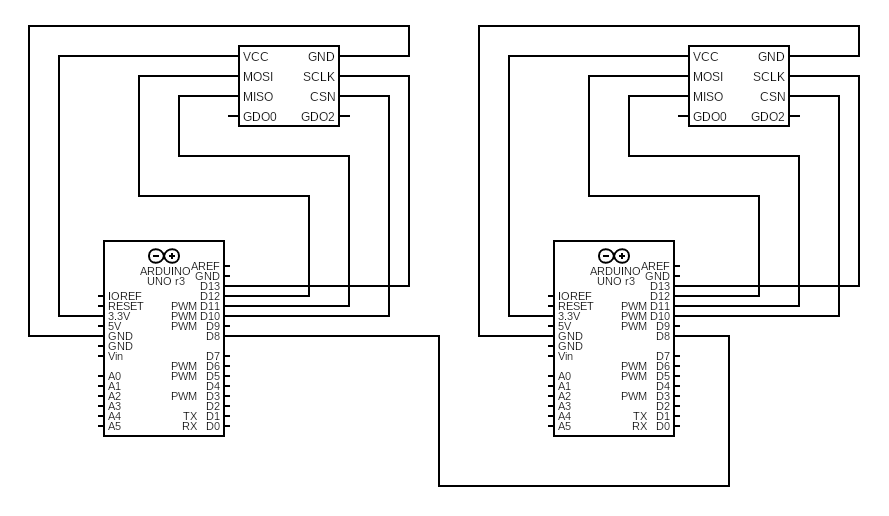

# Embedded systems (Radio Hacking)

The code presents the practical use of CC1101 radio modules to intercept signals transmitted by car remote controls at the frequency of 433 MHz. The library used for CC1101 is [RadioLib](https://github.com/jgromes/RadioLib).

Keep in mind it is a **crime** to use any apparatus, including jammers, for the purposes of deliberately interfering with wireless telegraphy (radio communications) in the most countries.

Authors:
- Dawid Liberda
- [Mateusz Furga](https://github.com/mfurga)

## Hardware

The SPI interface is used by the CC1101 module for communication. The MISO, MOSI, and SCLK pins on your Arduino board should be connected to certain SPI pins. Any digital pin can be used to link the CSn.

Additionally, the CC1101 exposes two general-purpose pins (GDO0 and GDO2) that can be used to interrupt the MCU when particular conditions are met, such as when the RX FIFO is full. They are not necessary for proper work and are optional - we don't use them in the code.

We use two independent Arduino boards - Arduino Fio and Arduino Pro Mini along with two CC1101 radio modules. The wiring is following:

## CC1101_FSK_Sender

An example of sending multiple "Hello World from the CC1101 module!" messages in FSK (Frequency-Shift Keying) modulation. Preamble is 16 bits length and sync word is set to 0x2169.

## CC1101_FSK_Receiver

An example of receiving radio signals in FSK modulation. The signal must have a sync word set to 0x2169. Combining the code with CC1101_FSK_Sender we can have a wireless communication on 433 MHz.

## CC1101_Jammer

An example of jamming the 434.32 MHz frequency band by continuous data transmission. When a device transmits on exactly this frequency, it will not be able to send the message correctly.

## CC1101_Wide_Jammer

An example of jamming a wide band frequency from 433.5 MHz to 434.7 MHz. Running such a code causes to interfere with any communication on this band.

## Embedded_Transmitter + Embedded_Receiver

Radio Hacking System consists of two Arduino boards connected to each other with digital pin number 8. The receiver activates the jammer through this pin and starts listening for a specific signal from the car key. After receiving two signals, it stops the jammer and transmits the first of the captured signals. After 10 seconds, it sends a second signal - which can be used, for example, for unauthorized opening of the car.
